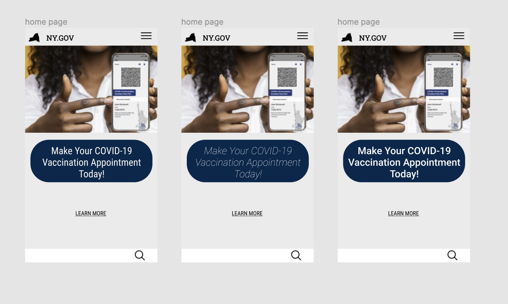
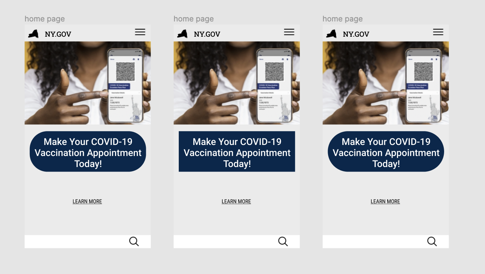
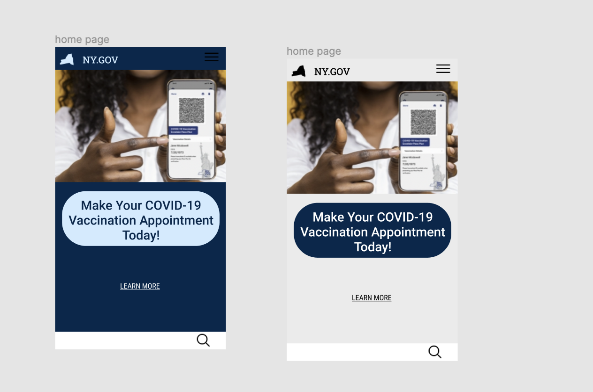
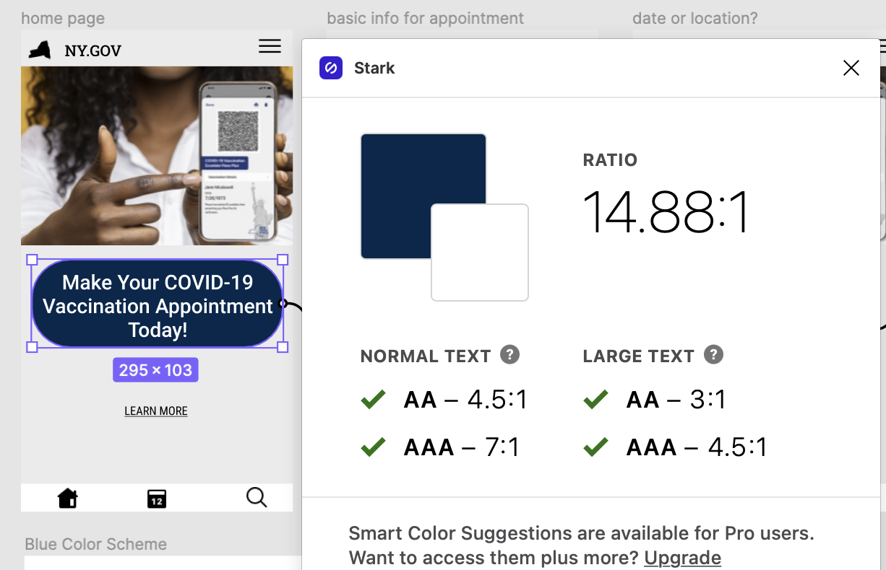
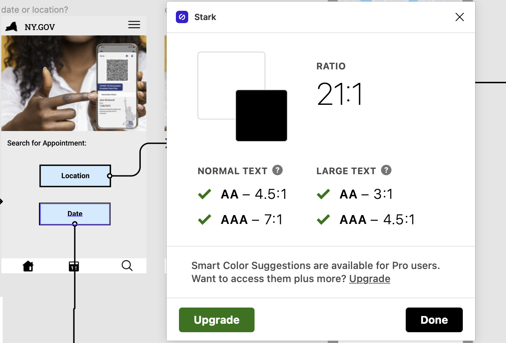
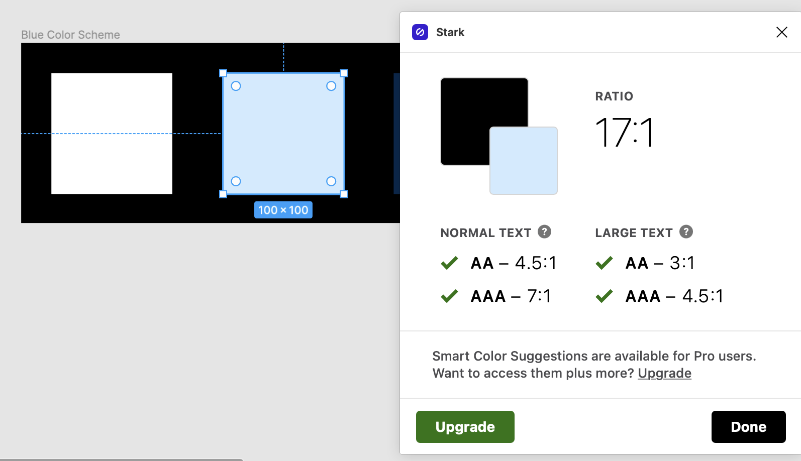
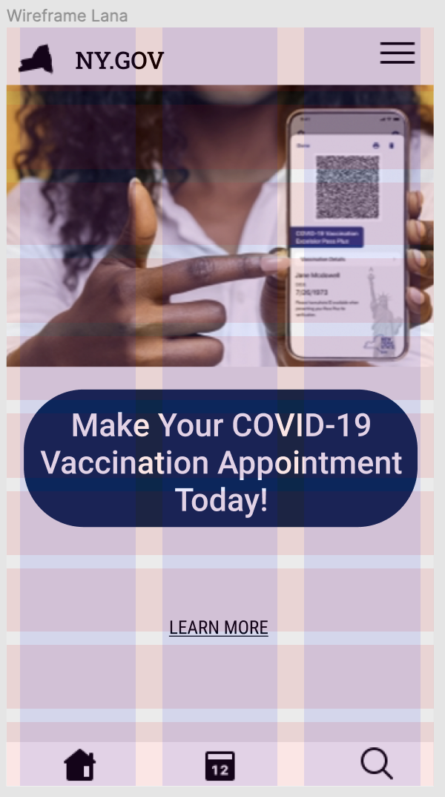

# Interface Design 
> The purpose of my project was to make an app to make COVID-19 vaccination appointments. My app was made for the population of New York but could be applied to any state in the US. I constructed an easy to use app as this is a government service that will theoritically be used by the general population of New York would be using the service provided.
#### You can find the wireflow of the main feature of the app, creating an appointment for vaccination, [here](https://www.figma.com/file/lwrlhWmROOkxfMUdKJW40Z/Untitled?node-id=0%3A1).
## Design Variation
> When I began to deisgn my app, I tried various shapes, fonts, and colorways to see which worked best on my homepage. I made sure to do this step first so the shapes, fonts, and colorways could be consistent throughout the app.
### Typography

#### I tried 3 different fonts from the Roboto font family on the main part of the homepage, the appointment button. I used Roboto compressed on the left, Roboto thin in the middle, and Roboto medium for the far left. I decided on Roboto medium for the buttons on this app as they are the clearest to read.
### Button Shapes

#### I tried 3 different shapes for the appointment button. I tried a rectangle with 45 degree curves for the corners, a regular rectangle, and a rectangle with 65 curves for the corners. I found that the rectangle with the 45 degrees was most useful as the regular rectangle looked to harsh as a welcome, and the rectangle with 65 degree corners was too squished and the text was not as clear as the rectangle I decided on.
### Colorways

#### Above are my dark mode and light mode for the app. I decided that the light mode would be most effective.

#### I also contrasted checked all my colors on the app with their background to make sure that they passed the color contrast test. I also included the color contrast test for the baby blue I used for my buttons against black as black outlined all these buttons to make them visible and testing against the background would not give accurate results.
### Spacing

#### Above is an example of the layout grid for the app I created. This shows that the spacing of the app is suitable for most users. Based on the first tray, we can see that the bottom icons will need to be centered more accurately for the final layout.
### Impression Testing
> I had my friend from freshamn year, Alex, view the app and its layout. Alex's first impression was that it was, "very clean and simplistic". Her only negative criticism is that blue is a verey basic color that is used on most apps regardless of their purpose. This is definitely something I will keep in mind and I am now considering reworking the colorway of the app. 
## Summary of Stylistic Choices
> I decided on the Robot font family as it is widely used and easy to read. I used Roboto Medium for all buttons as well as Roboto Condensed and Roboto Lite throughout the app to add variation and emphasis on specific features. Font size 24 was used for the appointment button, size 16 was used for all other buttons, and size 14 was used for all other type. Line spacing was left normal. I used a rounded button on the open page to be welcoming and later transitioned to regular rectangles/squares. I later realized that this inconsistency might prove to be confusing for users and made all buttons use 45 degree rounded edges. As for the colorway, I used a series of dark and light blue in addition to the traditional black and white colors that are present throughout almost every UI/UX design.
## Summary of Findings
> I found that the feedback from my impression testing was very useful as Alex was able to identify what the task was and how to nvaigate through making an appointment. My biggest takeaway from this testing is the stylistic feedback about the various colors used throughout my app design. It was also very interesting to see all the desgin elements, font, color, and shapes, interect within my prototype. After learning Figma inside and out I can see how useful it is not only in the scope of this class but also for professional reasons as well. This is definitely knowledge that I will carry with my beyond this class and even graduation.
